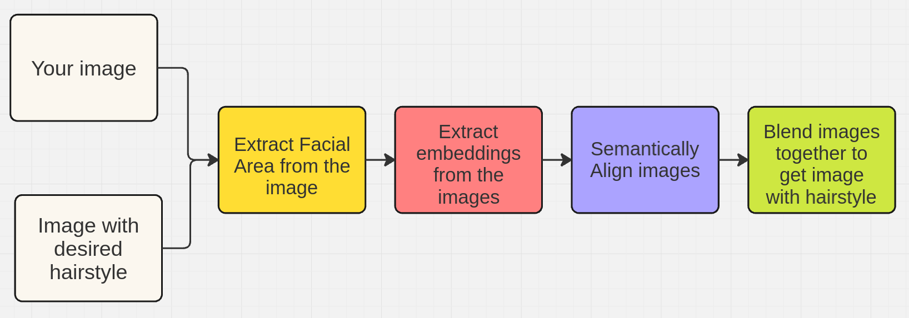
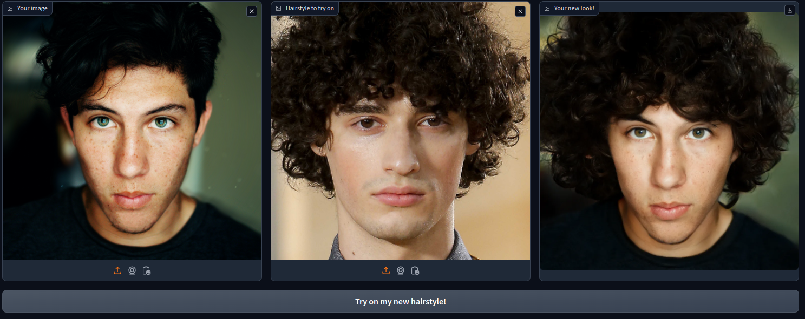
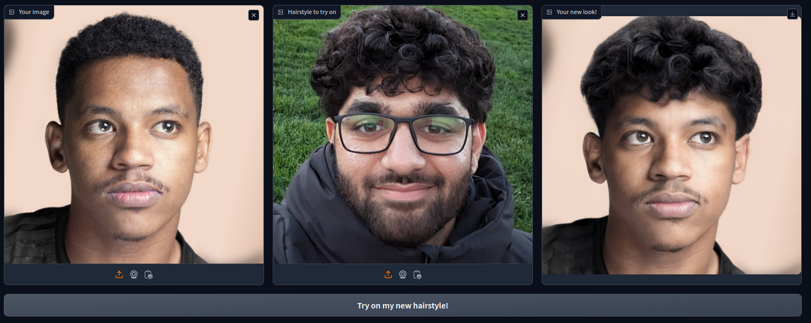
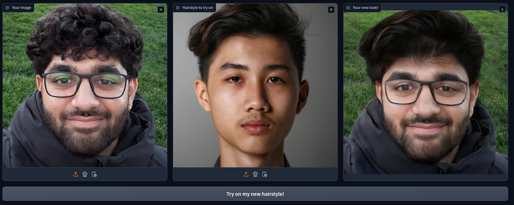
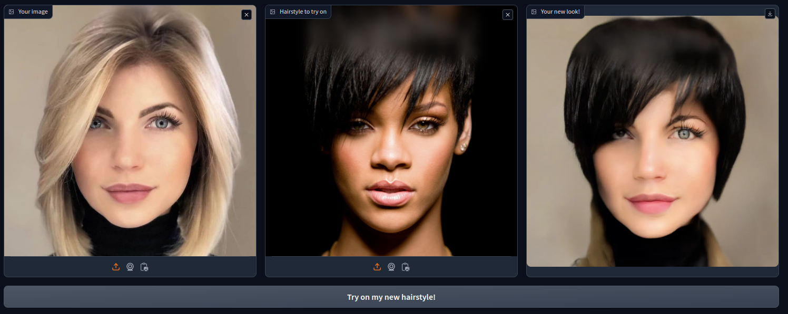
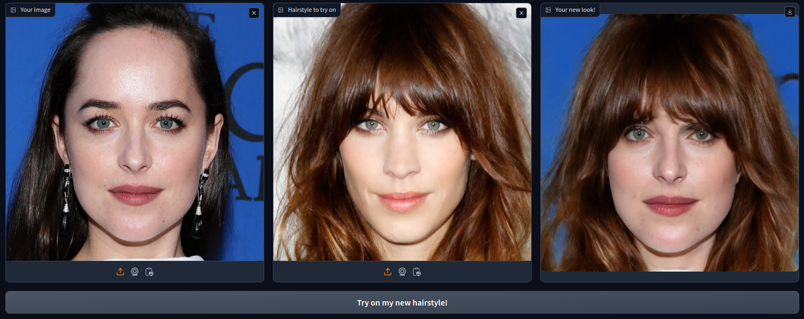
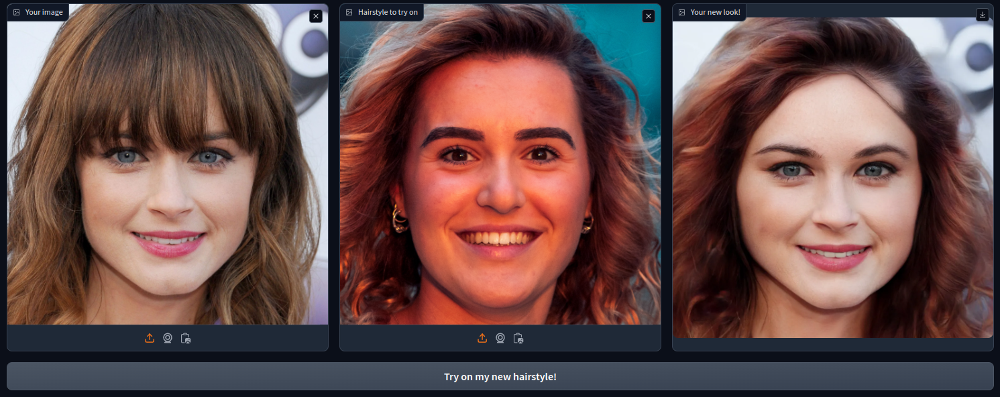
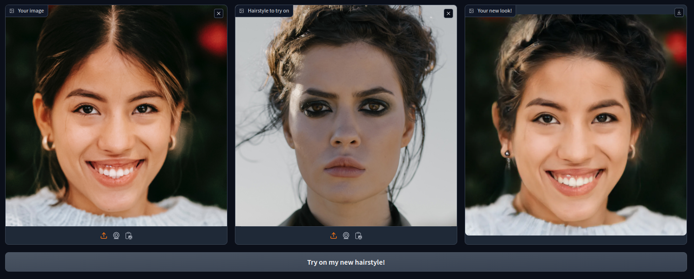

## What happened in week 2?
Well, I was unfortunately for most of the week, but oh well. This week was meant for creating a toy of the product. The main things I did were - 
1. Tried to look at some literature about virtual hairstyle tryon and see if there is anything I can use.
2. Used one existing repo [Barbershop](https://github.com/ZPdesu/Barbershop) (based on GAN inversion + blending) to try and build a toy using gradio.  
3. Carried out some tests with images to see what sort of results I could get! (find them in the [sample results](#some-sample-results) section)
## Quick overview of the current pipeline
This is just the general overview, for more details, I would suggest reading the paper!

## Initial thoughts
1. The pipeline is slow, the embedding step specially takes the most time. It takes around ~7 mins to generate one result locally (with a RTX 3070) at 1024x1024. It's annoying to play around and experiment with params due to this. Need to make this quicker for sure.
2. It's hard to make any assumptions about reasons of why performance is going wrong due to the lack of samples having been generated with different settings.
3. The alignment step done using the dlib face detector doesn't work well at times to extract faces from the images.
4. The facial area is cropped to only areas near the face, this results in the whole profile of the hair not being captured for images of women. Pretty big issue!
5. The process also ends up blending the facial structure a lot which is another issue. So pose + facial structure of reference image matters a lot for this pipeline.
6. The results aren't too great for the examples I tried out, maybe I need to experiment with the various params more though. 
7. Atleast provides a decent baseline for further work!

## Some sample results 

