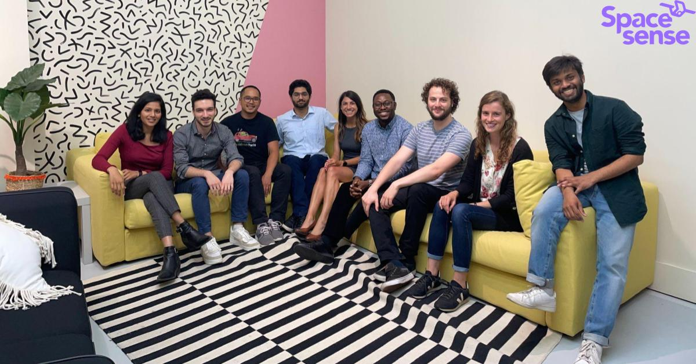
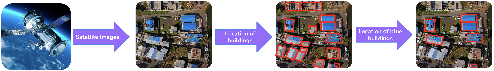
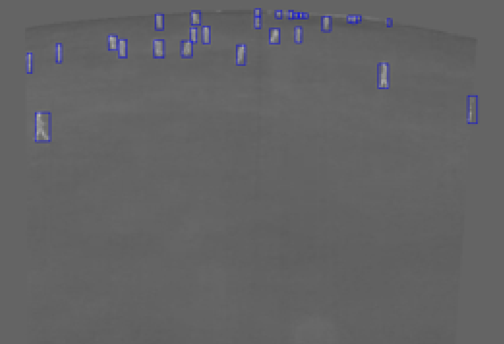
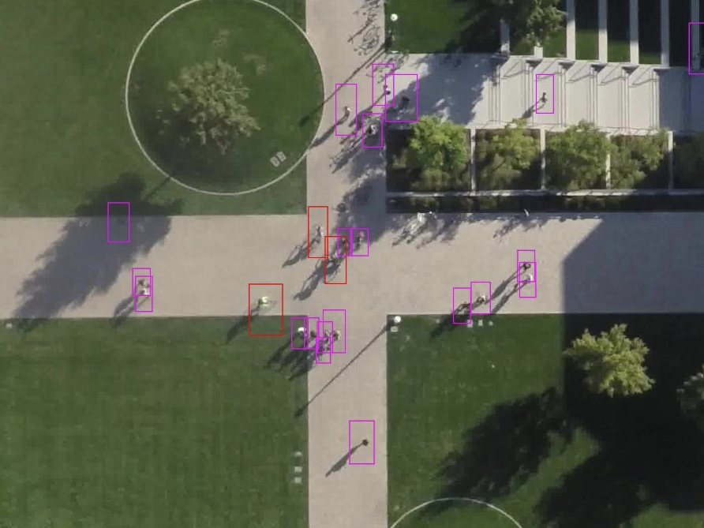
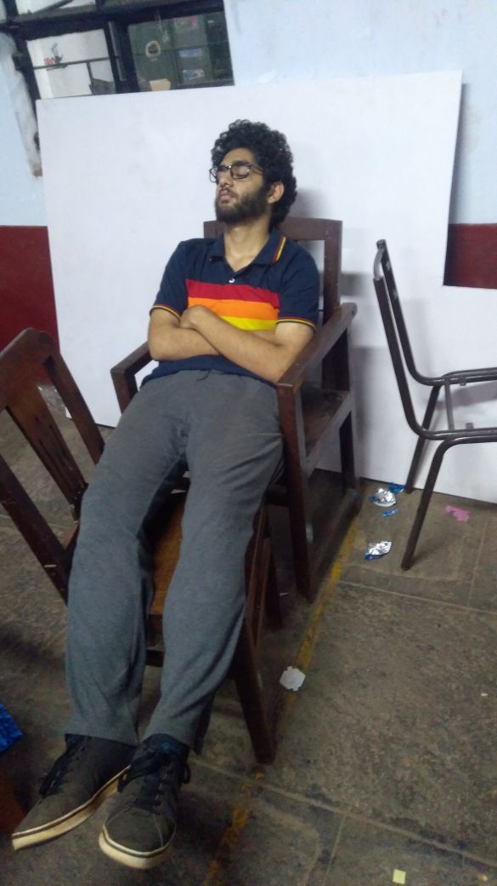
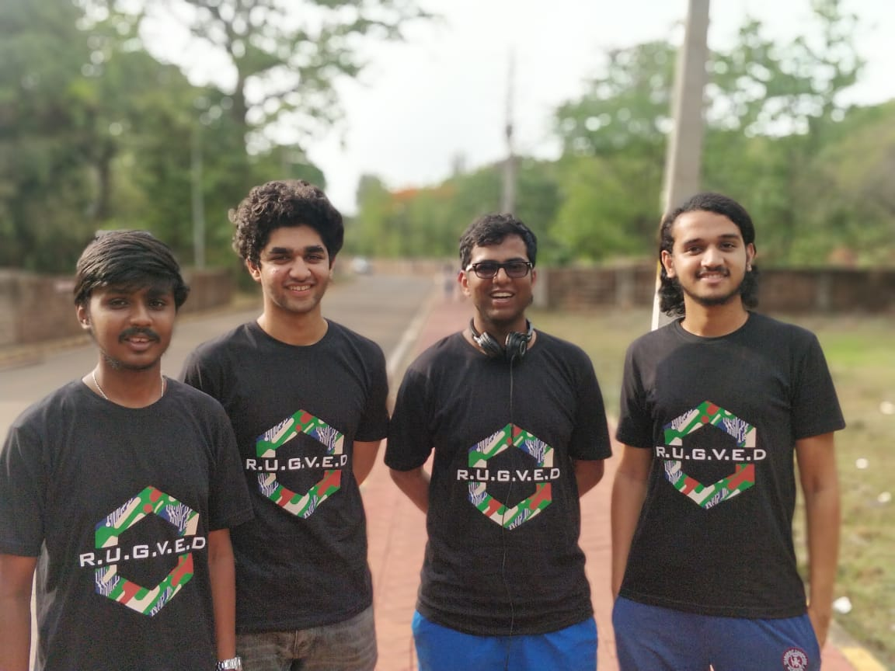
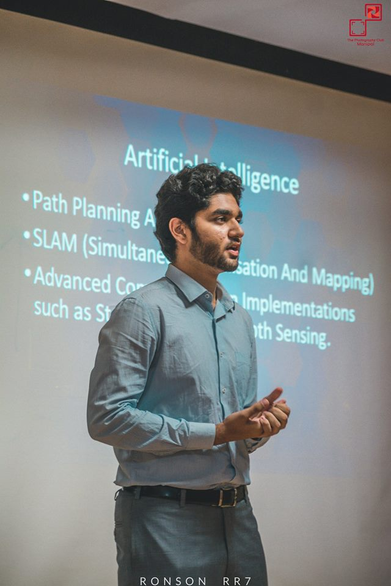
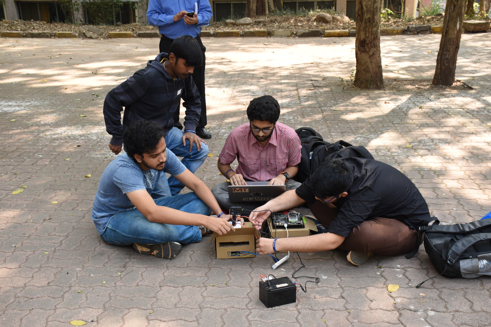
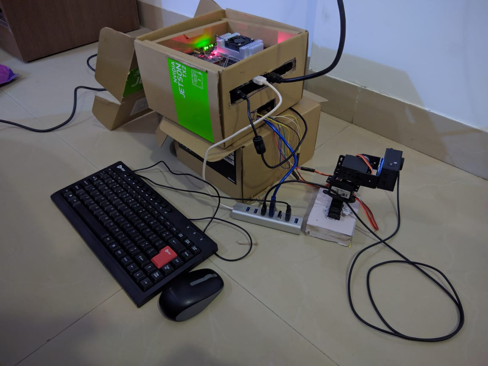
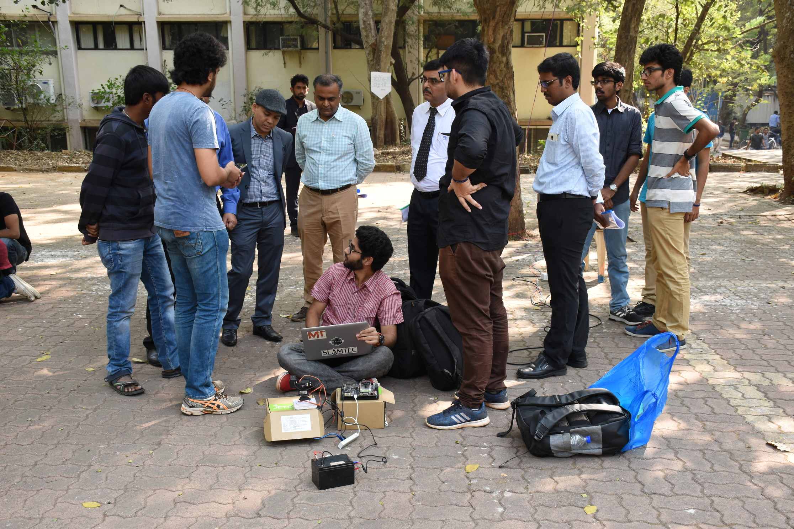


This page is a work in progress 





<ul> 
  <li>Developed a pipeline to automate training of time series crop type segmentation models from vector label data.</li>
  <li>Developed a pipeline to automate the training of landcover segmentation models from vector label data and packaged this as a workflow for customers</li>
  <li>Published <a href="https://www.climatechange.ai/papers/neurips2022/116#recording" target="_blank"><b>CCAI@NeurIPS 2022 tutorial for LULC dataset creation and model training</b></a>.</li>
  <li>Published technical blogs and took part as a presenter in company webinars.</li>
  <li>Developed POCs on S2 Super‑resolution and S2 Data Augmentation <a href="https://www.spacesense.ai/platform#data-preparation" target="_blank"><b>Data Preparation for AI</b></a></li>
  <li>Feature development and refinement for <a href="https://www.spacesense.ai/platform#data-preparation" target="_blank"><b>Data Preparation for AI</b></a>, a toolbox specialized to remote sensing data.</li>
  <li>Deployment and monitoring of Beyond Cloud for testing by clients.</li>
</ul>



<!-- 
<iframe width="500" height="315" src="https://www.youtube.com/embed/HQKNZSBWaTE?start=1900" title="YouTube video player" frameborder="0" allow="accelerometer; autoplay; clipboard-write; encrypted-media; gyroscope; picture-in-picture; web-share" allowfullscreen></iframe> -->




<ul> 
  <li>Beyond Cloud‑ Developed GAN based model to predict S2 vegetative indices from S1 SAR.</li>
  <li>new models outperformed the previous model with a 30‑40% improvement in the average loss for the test set.</li>
  <li>Developed a modular and distributed model training pipeline including experimental tracking and artifact storage on GCP.</li>
  <li>Developed a modular data acquisition pipeline which was used to create a dataset of 120 GB for our image to image translation task.</li>
  <li>Extensive work on data visualisation and model benchmarking w.r.t both computer vision and remote sensing perspectives.</li>
</ul>




<ul> 
  <li>Developed POC for an end to end object detection pipeline using satellite images for tracking repairs of damaged roofs.</li>
  <li>The inference pipeline solved issues for running ML models on very high resolution images and bounding box resolution.</li>
  <li>The work included dataset creation and annotation, satellite imagery pre and post processing, model benchmarking and a <a href="https://tarp-detection.spacesense.ai/" target="_blank"><b>demo website.</b></a></li>
</ul>




<ul> 
  <li>Implemented SOTA object detection architectures such as YOLOv3 and RetinaNet for localisation of humans in aerial and thermal images.</li>
  <li>As a key member of the research team, I tackled major challenges including boosting the speed of detection and accurately detecting small objects.</li>
  <li>My in-depth understanding of different object detection architectures allowed me to make significant contributions to our use case</li>
  <li>I helped in creating plots and creating the training pipeline for the SSD model for our paper <a href="https://www.mdpi.com/2079-9292/11/7/1151" target="_blank"><b>"Human Detection in Aerial Thermal Images Using Faster R-CNN and SSD Algorithms</b></a>"</li>
</ul>


  
  
  





<ul> 
  <li>Developed semantic segmentation models for multi-spectral very high resolution satellite imagery for buildings, agricultural land
and trees using Unet based model architectures.</li>
  <li>Migrated and structured old tree based algorithms into a python library</li>
  <li>Helped in improving the MIoU by 50% from the previous approach</li>
  <li>Worked on creating and testing a basic approach for Devanagri alphabet recognition.</li>
</ul>




<ul> 
  <li>Developed the complete ROS stack for a warehouse UGV prototype including simulation, perception, localisation and path planning modules.</li>
</ul>




<ul> 
  <li>Created the technical roadmap of the project based on the task "automated surveillance of buildings by unskilled workers using drones." 
  <li>Developed and deployed an autonomous one-shot object matching, detection and tracking system using drones as the base platform and the Jetson Nano as the processing board.</li>
  <li>Created an API for using the DJI Tello SDK with the PixHawk ROS package.
  <li>Presented live tech demos of the product for the core management team and potential clients</li> 
  <li>Worked in an office environment for the first time in my life, working under seasoned industry innovators.</li>
</ul>







<ul> 
  <li> Led the AI team consisting of 4 members working on developing an autonomous UGV for automated reconaissance and disaster management. 
  <li> <b>Won the TATA Makerthon 2018 </b> held at IIT Bombay by creating a zero-shot 360 degree object matcher for drones, beating 142 teams across India. 
  <li> Developed the full software stack(mapping, perception, localistion) of an autonmous UGV based on ROS for the Intelligent Ground Vehicle Competition (IGVC).
  <li> Integrated software and hardware stacks and tested them in real-time on the UGV. </li>
  <li> Participated and <b>placed 8th in the IGVC competition </b>(design report).
  <li> Conducted tests and task phases to recruit new members to the team.
  <li> Had a shitload of fun goofing around with friends and taking advantage of the extended hostel permits. 
</ul>


  
  
  
  
  
  
  



 







