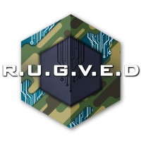

## Experience

I am currently pursuing my Master's in Computer Vision at Carnegie Mellon University. You can find my detailed CV <a href="https://drive.google.com/file/d/1MJmAwludn_qDEmETcdabf_bKFYIlbomV/view" target="_blank">here</a>.

<table class="experience-table">
    <thead>
        <tr>
            <th>Company</th>
            <th>Link</th>
            <th>Role</th>
            <th>Dates</th>
            <th>Location</th>
        </tr>
    </thead>
    <tbody>
        <!-- <tr>
            <td class="logo-cell" data-label="Company"></td>
            <td data-label="Link"><a href="https://www.uci.edu/" target="_blank">UC Irvine</a></td>
            <td data-label="Role">Research Collaborator with Dr. Nadia Ahmed</td>
            <td data-label="Dates">2024-08 - Present</td>
            <td data-label="Location">Remote</td>
        </tr> -->
        <tr>
            <td class="logo-cell" data-label="Company"></td>
            <td data-label="Link"><a href="https://xfarm.ag/en" target="_blank">xFarm Technologies</a></td>
            <td data-label="Role">ML Research Engineer</td>
            <td data-label="Dates">Aug 2021-Aug 2025</td>
            <td data-label="Location">Paris, France</td>
        <!-- </tr>
                <tr>
            <td class="logo-cell" data-label="Company"></td>
            <td data-label="Link"><a href="https://www.valvodengine.com/" target="_blank">Val-Vod-Engine</a></td>
            <td data-label="Role">Founder & Solo dev</td>
            <td data-label="Dates">Aug 2024 - Present</td>
            <td data-label="Location">Remote</td>
        </tr> -->
        <tr>
            <td rowspan=3 class="logo-cell" data-label="Company"></td>
            <td rowspan=3 data-label="Link"><a href="https://www.spacesense.ai/" target="_blank">Spacesense (acquired by xFarm in 2024)</a></td>
            <!-- <td data-label="Role">ML Lead</td>
            <td data-label="Dates">Aug 2021 - Dec 2023</td>
            <td data-label="Location">Paris, FR</td> -->
        </tr>
        <tr>
            <td data-label="Role">ML Intern</td>
            <td data-label="Dates">Feb 2021-Jul 2021</td>
            <td data-label="Location">Paris, France</td>
        </tr>
        <tr>
            <td data-label="Role">Freelance ML Engineer</td>
            <td data-label="Dates">Aug 2020-Oct 2020</td>
            <td data-label="Location">Remote</td>
        </tr>
        <tr>
            <td class="logo-cell" data-label="Company"></td>
            <td data-label="Link"><a href="https://www.meity.gov.in/" target="_blank">National Informatics Center</a></td>
            <td data-label="Role">ML Intern</td>
            <td data-label="Dates">Dec 2019-Jan 2020</td>
            <td data-label="Location">Delhi, India</td>
        </tr>
        <tr>
            <td class="logo-cell" data-label="Company"></td>
            <td data-label="Link"><a href="https://www.manipal.edu/mit/department-faculty/department-list/computer-applications.html" target="_blank">Dept. of Computer Applications, Manipal Institute of Technology</a></td>
            <td data-label="Role">Volunteer Researcher</td>
            <td data-label="Dates">Aug 2019-Nov 2019</td>
            <td data-label="Location">Manipal, India</td>
        </tr>
        <tr>
            <td class="logo-cell" data-label="Company"></td>
            <td data-label="Link"><a href="https://www.tata.com/" target="_blank">TATA Sons</a></td>
            <td data-label="Role">Computer Vision and Robotics Intern</td>
            <td data-label="Dates">May 2019-Jul 2019</td>
            <td data-label="Location">Bangalore, India</td>
        </tr>
        <tr>
            <td class="logo-cell" data-label="Company"></td>
            <td data-label="Link"><a href="https://www.manipal.edu/mit/why/student-projects-manipal-university/rugved-systems.html" target="_blank">RUGVED Systems</a></td>
            <td data-label="Role">AI Subteam Head</td>
            <td data-label="Dates">Jan 2018-Dec 2018</td>
            <td data-label="Location">Manipal, India</td>
        </tr>
    </tbody>
</table>

## Publications

<table class="experience-table">
    <thead>
        <tr>
            <th>Title</th>
            <th>Authors</th>
            <th>Date</th>
        </tr>
    </thead>
    <tbody>
        <tr>
            <td data-label="Title"><b>[GEOINT 2023]</b></td>
            <td data-label="Authors">Sambhav Singh Rohatgi, Jyotsna Buddideti</td>
            <td data-label="Date">Apr 2023</td>
        </tr>
        <tr>
            <td data-label="Title"><b>[CCAI@NeurIPS 2022]</b><a href="https://www.climatechange.ai/papers/neurips2022/116" target="_blank"> Automating the creation of LULC datasets for semantic segmentation</a></td>
            <td data-label="Authors">Sambhav Singh Rohatgi, Anthony Mucia</td>
            <td data-label="Date">Dec 2022</td>
        </tr>
        <tr>
            <td data-label="Title"><b>[Electronics11071151]</b><a href="https://www.mdpi.com/2079-9292/11/7/1151" target="_blank"> Human Detection in Aerial Thermal Images Using Faster R-CNN and SSD Algorithms</a></td>
            <td data-label="Authors">K. R. Akshatha, A. Kotegar Karunakar, Satish Shenoy, Abhilash Pai, Nikhil Nagaraj, Sambhav S. Rohatgi</td>
            <td data-label="Date">Apr 2022</td>
        </tr>
    </tbody>
</table>

---
