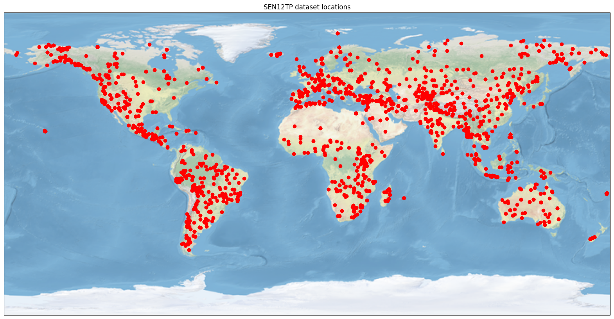
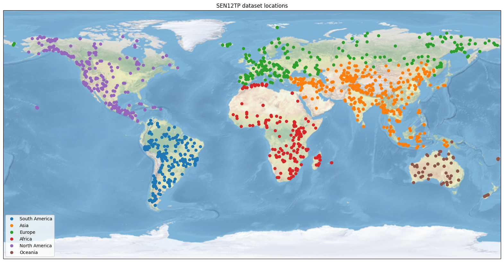
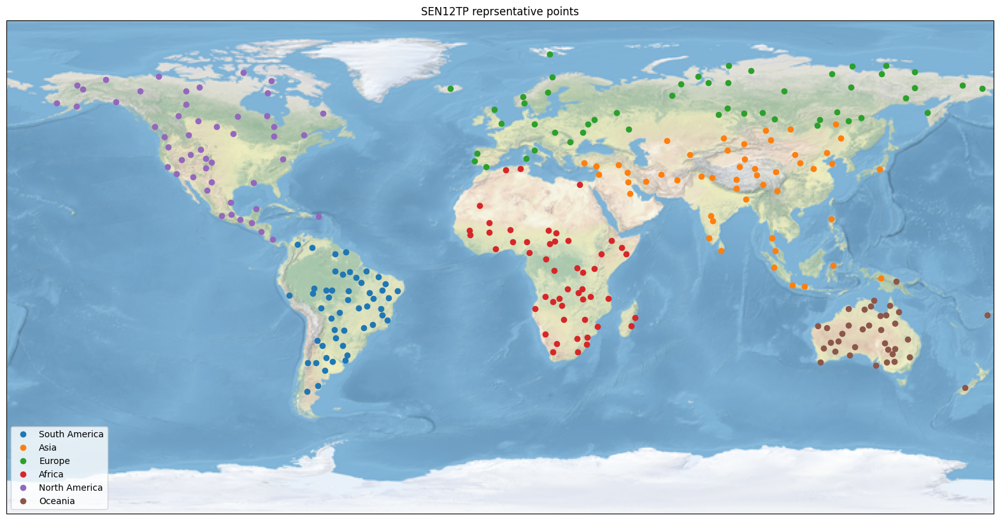

## Motive
The motive of the following post is to take a look at how to cluster geospatial data using the **Density-Based Spatial Clustering of Applications with Noise** (DBSCAN) algorithm. 

As a use case for this post we will look at how we can find the most representative data points for each continent to test geographical variation in a dataset for a theoretical ML model. 

We will use the [SEN12TP](!https://zenodo.org/record/7342060) dataset for demostation here.

## What is DBSCAN and why is it useful for geospatial clustering?
The DBSCAN algorithm is a popular density-based clustering algorithm used for identifying clusters and outliers in spatial data. It is particularly well-suited for geospatial data because it can handle data with irregularly shaped clusters and varying densities effectively, something that traditional algorithms such as k-means are not able to do. 

DBSCAN defines clusters as dense regions of data points separated by regions of lower density. The algorithm works by exploring the density connectivity of the data points. To learn more about how it works visit the following [https://www.analyticsvidhya.com/blog/2020/09/how-dbscan-clustering-works/](!https://www.analyticsvidhya.com/blog/2020/09/how-dbscan-clustering-works/).

The advantages of DBSCAN for geospatial data include- 
- Robustness to noise: DBSCAN can effectively handle outliers and noise points as they are considered separate from clusters. It does not assign them to any specific cluster and does not force them to belong to a cluster.
- Ability to detect clusters of arbitrary shape: DBSCAN can identify clusters with irregular shapes, making it suitable for geospatial data where clusters may have complex spatial distributions.
- Handling of varying cluster densities: DBSCAN can handle clusters of different densities. It can adapt to regions with high-density clusters as well as regions with low-density clusters.

## Our problem statement
- Let's say we have a hypothetical model for sentinel-1 to sentinel-2 image to image transalation that we want to test on this dataset.

- In particlar we want to test the model for geographical variance in performance per continent. 
  
- The dataset contains too many points per continent and we need some way to reduce these to get the most representative points for each continent.

- We use the DBSCAN algorithm to find N most representative points per continent.

## Downloading the dataset
The [SEN12TP](!https://zenodo.org/record/7342060) dataset contains paired set of imagery from the sentinel-1 and sentinel-2 satellite, but we won't be using the imagery here, wplt.figure(figsize=(20, 20))
ax = plt.axes(projection=ccrs.PlateCarree())
ax.stock_img()

ax.plot(gdf["lon"], gdf["lat"], "o", color="r")
plt.title("SEN12TP dataset locations")to get geolocations from all over the world.

Download the metadata for the dataset using the following command - 

```bash
wget https://raw.githubusercontent.com/Sambhav300899/blog_notebooks/main/clustering/dbscan/sen12tp-metadata.json
```

## Loading the dataset
We can use `geopandas` to directly load the dataset. 

```python
import geopandas as gpd 

gdf = gpd.read_file("sen12tp-metadata.json")
``` 

The dataset is in a different [CRS](!https://docs.qgis.org/3.28/en/docs/gentle_gis_introduction/coordinate_reference_systems.html) than WGS84, converting it to WGS84 format will allow us to look at it as lattitude and longitude values. The [epsg](!https://support.virtual-surveyor.com/en/support/solutions/articles/1000261353-what-is-an-epsg-code-#:~:text=EPSG%20stands%20for%20European%20Petroleum,spheroids%2C%20units%20and%20such%20alike.) code for WGS84 format is `4326`. We can use geopandas to convert our data to the WGS84 projection.

Each row of the geopandas dataframe represents one image location. We extract the latitude and longitude of the centroid of each image location.

```python
# convert to crs 4326 to get lat lon
gdf = gdf.to_crs(epsg=4326)
gdf = gdf[["geometry"]]

# get lat lon of centroids
gdf["centroid"] = gdf["geometry"].centroid
gdf["lat"] = gdf["centroid"].y
gdf["lon"] = gdf["centroid"].x
```

Lets see what all data we have in the dataframe now - 
```
gdf.head()
```
|    | geometry                                                                                                                                                                                                      | centroid                                      |      lat |       lon |
|---:|:--------------------------------------------------------------------------------------------------------------------------------------------------------------------------------------------------------------|:----------------------------------------------|---------:|----------:|
|  0 | POLYGON ((-70.41461164636456 -34.46821038082358,... | POINT (-70.30 -34.55) | -34.5596 | -70.3071  |
|  1 | POLYGON ((72.28825977983655 34.050558629310395,... | POINT (72.399 33.96)  |  33.9627 |  72.3993  |
|  2 | POLYGON ((-8.424361551813695 41.53310978422038,... | POINT (-8.305 41.44)  |  41.4423 |  -8.3054  |
|  3 | POLYGON ((6.724249816765044 46.5562534318746,... | POINT (6.85 46.46)   |  46.4688 |   6.85822 |
|  4 | POLYGON ((-0.554267167211116 42.60345308513507,... | POINT (-0.43 42.51) |  42.5108 |  -0.43611 |

## Plotting all of the locations
We will use the cartopy library to plot a map of the earth and the locations of our datapoints on it.  


```python
import cartopy.crs as ccrs

plt.figure(figsize=(20, 20))
ax = plt.axes(projection=ccrs.PlateCarree())
ax.stock_img()

ax.plot(gdf["lon"], gdf["lat"], "o", color="r")
plt.title("SEN12TP dataset locations")
```


## Reverese geocoding
We want to get N points per continent, it is important to know what continent each location belongs to before we do this. To do this we will use the [`reverse_geocoder`](!https://pypi.org/project/reverse_geocoder/) library.

```python
import reverse_geocoder as rg

continent_dict = {
    "NA": "North America",
    "SA": "South America",
    "AS": "Asia",
    "AF": "Africa",
    "OC": "Oceania",
    "EU": "Europe",
    "AQ": "Antarctica",
}

gdf["continent_code"] = rg.search(list(map(tuple, gdf[["lat", "lon"]].values)))
gdf["continent_code"] = gdf["continent_code"].apply(
    lambda x: pc.country_alpha2_to_continent_code(x["cc"])
)
gdf["continent_name"] = gdf["continent_code"].apply(lambda x: continent_dict[x])
```

Let's plot the points again to confirm that we geocoded correctly.
```python
plt.figure(figsize=(20, 20))
ax = plt.axes(projection=ccrs.PlateCarree())
ax.stock_img()

for continent_name in gdf["continent_name"].unique():
    ax.plot(
        gdf[gdf["continent_name"] == continent_name]["lon"],
        gdf[gdf["continent_name"] == continent_name]["lat"],
        "o",
        label=continent_name,
    )

plt.legend()
plt.title("SEN12TP dataset locations")
```


## Running DBSCAN per continent
We will now run the DBSCAN algorithm per continent to get 50 representative points for the same. 

We first define functions to run the DBSCAN algorithm - 
```python
def get_centermost_point(cluster):
    # This function is useful for getting the centerpoint of a cluster

    # We first extract the centroid of the cluster
    centroid = (MultiPoint(cluster).centroid.x, MultiPoint(cluster).centroid.y)

    # we then calculate the distrances between all points and the centerpoint of the cluster and take the one with the least distance
    centermost_point = min(cluster, key=lambda point: great_circle(point, centroid).m)
    return tuple(centermost_point)


def get_n_filtered_pts(gdf_dbscan, max_pts=10, max_dist_km=200):
    # This function runs dbscan on a geodataframe and retruns `max_pts` representative locations for it. 
    # the max_dist_km is the maximum distance that a point can be from the center of the cluster
    # we will also convert all of our data to radians

    # we first extract the latitudes and longitudes in the form of a numpy array
    coords = gdf_dbscan[["lat", "lon"]].values
    
    # we then calculate the `epsilon` paramter which is converting our `max_dist_km` to radians
    # look at this to understadnd - https://stackoverflow.com/a/49212829
    kms_per_radian = 6371.0088
    epsilon = max_dist_km / kms_per_radian

    # Run DBSCAN
    db = DBSCAN(
        eps=epsilon, min_samples=1, algorithm="ball_tree", metric="haversine"
    ).fit(np.radians(coords))

    # get labels for each point in our dataset
    cluster_labels = db.labels_

    # get the number of clusters by looking at the number of unique clusters
    num_clusters = len(set(cluster_labels))

    # get the different points in each cluster
    clusters = pd.Series([coords[cluster_labels == n] for n in range(num_clusters)])

    # get the centermost point in each cluster
    filtered_pts = list(clusters.map(lambda x: get_centermost_point(x)))

    # if we have points more than the required amount, randomly sample
    if len(filtered_pts) > max_pts:
        filtered_pts = random.sample(filtered_pts, max_pts)

    return filtered_pts

```

We then use the following code to run DBSCAN per continent and create a geodataframe of the filtered data points. 

```python
num_pts_per_continent = 50
all_filtered_pts = []

# run per continent
for continent_name in gdf["continent_name"].unique():
    continent_gdf = gdf[gdf["continent_name"] == continent_name]
    all_filtered_pts.extend(get_n_filtered_pts(continent_gdf, num_pts_per_continent))

# get all lat and lons for all continents
lats, lons = zip(*all_filtered_pts)
rep_points = pd.DataFrame({"lon": lons, "lat": lats})

# extract all other information about these points from the original geodataframe
filtered_gdf = rep_points.apply(
    lambda row: gdf[(gdf["lat"] == row["lat"]) & (gdf["lon"] == row["lon"])].iloc[0],
    axis=1,
)
```

Let's visualise this now to see the final datapoints we get. 

```python
plt.figure(figsize=(20, 20))
ax = plt.axes(projection=ccrs.PlateCarree())
ax.stock_img()

for continent_name in filtered_gdf["continent_name"].unique():
    ax.plot(
        filtered_gdf[filtered_gdf["continent_name"] == continent_name]["lon"],
        filtered_gdf[filtered_gdf["continent_name"] == continent_name]["lat"],
        "o",
        label=continent_name,
    )

plt.legend()
plt.title("SEN12TP dataset locations")
```



## Conclusion
We see that we get a pretty good representation of the geograhical locations of our dataset in these points. We can now furthur use this to test our models geograhical performance. 


 Github Notebook 
