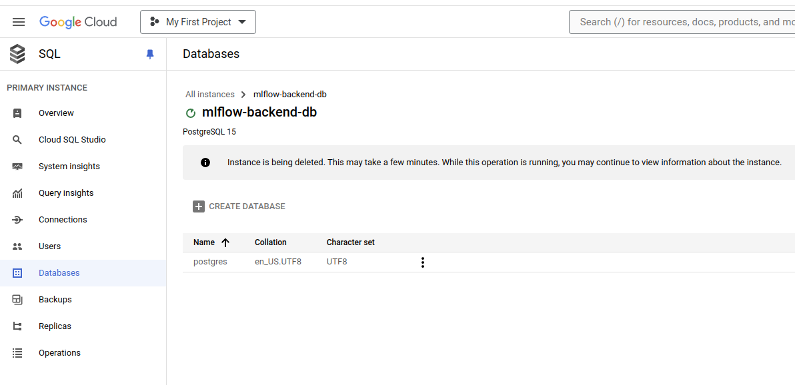
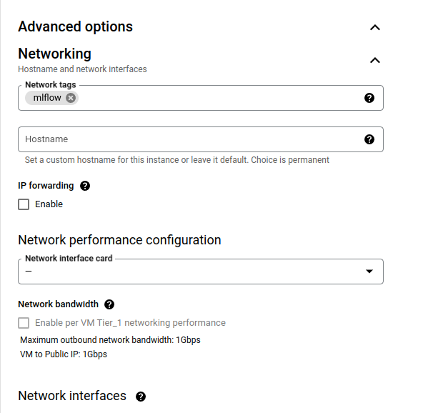
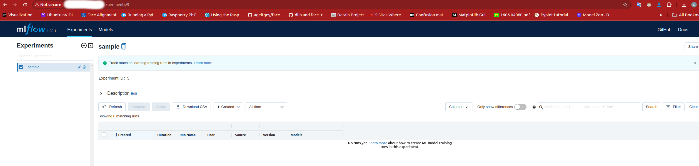
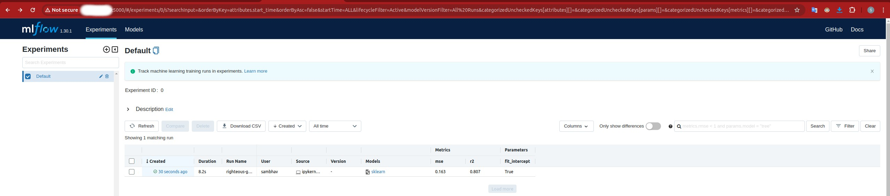

<!-- Contents-
- [Motive](#motive)
- [Create backed DB](#create backend DB)
- [Create GCS bucket](#create GCS bucket)
- [Create VM instance](#create VM instance)
- [Add firewall rule](#add firewall rule)
- [Run the MLflow server on the VM](#Run the MLflow server on the VM)
- [Access the MLflow dashboard](#Access the MLflow dashboard)
- [Running a sample experiment](#Running a sample experiment)
- [Issues with current approach ](#Issues with current approach )
-->

## Motive

MLflow is a popular library for experiment tracking for Machine Learning. In addition to experiment tracking, it also offers a model registery and tracking platform. MLFlow can be used with a local database and artifact store, this is usually good enough for running experiments personally. When we need multiple people to work on the same experiment or run training as a job, we need to host a remote MLflow server. 

In this post we will look at how we can host a MLflow server on GCP. In part 1 of this 2 part series, we will first look at how to host the remote server with a VM.

The aim of this post is to create a reusable script, so that we don't have to go through individual steps manually. We will only do the full script in the final post though, for now, we are going to use the UI where possible. 

## Create backend DB

We need to a cloud SQL database to store our data. This can be done by the following steps- 

1.  Go to the [cloud SQL page](https://console.cloud.google.com/sql)
2.  Click on `create instance`
3.  Click on `create a PostgreSQL instance`
4.  Fill in the `instance ID` and `password`. e.g. - I used "mlflow-backend-db" as the instance name and "test" as the password for now.
5.  When creating an DB instance, GCP creates the admin user as "postgres" by default, the entered password is linked to this admin username.
6.  For now select DB params and configuration to minimise cost, for example, I selected a custom config of 1 vCPU and 3.75 GB RAM. Also set storage capacity to 10 GB and make it single region. 
7.  Under the connections settings, make it so that `private IP` is ticked. Under associated networking, select the default network.  
8.  You can leave the rest as is. 
9.  Click on `create instance`.  

The instance will take some time to get created. A default database named "postgres" already exists, create a new db named "mlflow" (change the name according to your needs). To do this, go to the `Databases` section after selecting your instance and click on `create database`.


## Create GCS bucket

Create a GCS bucket to store our model training artifacts. You can use the following command - 
```bash
gsutil mb gs://{ARTIFACT_BUCKET_NAME}
```

I used the bucket name "mlflow-sample-bucket". Keep in mind GCS bucket names are globally unique, so you will need to enter a different name. 

## Create VM instance

To create a VM instance for our use - 

1.  Go to the [VM instance page](https://console.cloud.google.com/compute/instances?authuser=1&project=active-district-422616-u9)
2.  Click on `create instance`
3.  Select an E2 instance.
4.  Under boot disk, click on `change`. Here select the "Deep Learning for Linux" OS.
5.  Under `Identity and API access` select `Allow full access to all Cloud APIs`.
6.  Under `advanced_options/networking`, add a "mlflow" network tag. This will be useful to create a firewall and apply it to only VM's with this tag.
    
7.  Click on `create`.

## Add firewall rule

We need to add a firewall rule to allow incoming connections when we run the server. 
```bash
gcloud compute --project={your-project-id} \
firewall-rules create mlflow \
--direction=INGRESS \
--priority=1000 \
--network=default \
--action=ALLOW \
--rules=tcp:5000 \
--source-ranges=0.0.0.0/0 \
--target-tags=mlflow
```

We set the port to allow these connections to 5000, as that is the port mlflow uses by default. For the `target-tags` argument, we pass the `mlflow` tag, since that is the tag we assigned to our VM. You can also go and do this through the UI.  The source range 0.0.0.0/0 allows anyone on the internet to access this. 

## Run the MLflow server on the VM

To run the MLflow server on the VM, connect to your VM using ssh and run the following commands- 
```bash
pip install mlflow psycopg2-binary
```

The next command is of the form 
```bash
mlflow server \
-h 0.0.0.0 \
-p 5000 \
--backend-store-uri postgresql://{DB_USER_NAME}:{DB_USER_PASSOWRD}@{DB_PRIVATE_IP}:5432/mlflow \
--default-artifact-root gs://{ARTIFACT_BUCKET_NAME}
```

From our previous commands, we know the following - 
```bash 
DB_USER_NAME=postgres (remember this is the default admin name)
DB_USER_PASSWORD=test
DB_PRIVATE_IP=can be found in the overview page of the DB
ARTIFACT_BUCKET_NAME=mlflow-sample-bucket

mlflow server \
-h 0.0.0.0 \
-p 5000 \
--backend-store-uri postgresql://postgres:test@{private-ip}:5432/mlflow \
--default-artifact-root gs://mlflow-sample-bucket
```

We specify `-h` as `0.0.0.0` to listen on all available network interfaces, we specify `-p` as `5000` for the port to listen on. The 5432 port is the default port used by the DB here.

## Access the MLflow dashboard

You should now be able to use the mlflow server by accessing port 5000 of the external IP of your VM instance. This can be found in the [VM instances](https://console.cloud.google.com/compute/instances?authuser=1&project=active-district-422616-u9) page.

Type the following in your browser address bar- 
```
{externel-ip}:5000
```

et voila!

## Running a sample experiment

So how can we actually include this in our code when running an experiment? It is very simple, just add a line to include the address of your tracking and you're good. Look at the following very simple example for how to add it, other than that your code remains unchanged. 

Sidenote, ensure that the instance you run this on (local or VM) has a GCP account with access to write to the bucket we created above. If it does and you are having authentication issues, run the following (usually solves default authentication issue for me, but you might need to debug further) - 
```bash
gcloud auth login
gcloud auth application-default login
```

```python
import mlflow
import mlflow.sklearn
from sklearn.model_selection import train_test_split
from sklearn.linear_model import LinearRegression
import numpy as np
from sklearn.metrics import mean_squared_error, r2_score

# Generate random data
np.random.seed(42)
X = np.random.rand(100, 1)
y = 3 * X.squeeze() + 2 + np.random.randn(100) * 0.5

############## Set MLflow tracking URI ##############
mlflow.set_tracking_uri("http://<vm-external-ip>:5000")
#####################################################

# Split the data
X_train, X_test, y_train, y_test = train_test_split(
    X, y, test_size=0.2, random_state=42
)

# Start an MLflow run
with mlflow.start_run():
    model = LinearRegression()
    model.fit(X_train, y_train)
    predictions = model.predict(X_test)

    mlflow.log_param("fit_intercept", model.fit_intercept)
    mse = mean_squared_error(y_test, predictions)
    r2 = r2_score(y_test, predictions)
    mlflow.log_metric("mse", mse)
    mlflow.log_metric("r2", r2)

    mlflow.sklearn.log_model(model, "linear_regression_model")

    print(f"Model saved in run {mlflow.active_run().info.run_id}")
    print(f"MSE: {mse}")
    print(f"R2: {r2}")

```

After this your run should be visible on your mlflow dashboard `(<external-ip>:5000)` and would look something like the following - 


## Issues with current approach 

So we got this working, but there are many problems with this implementation, such as - 
1. We have no authentication, anyone can access this dashboard, not such a great approach.
2. We have no set version of mlflow being used, it might make more sense to use a more containerised approach. 
3. Scaling would be an issue, we will manually have to manage the VM.  We also pay for idle resources during low traffic. 

In part 2, we will try to find an approach that solves this issue. 
