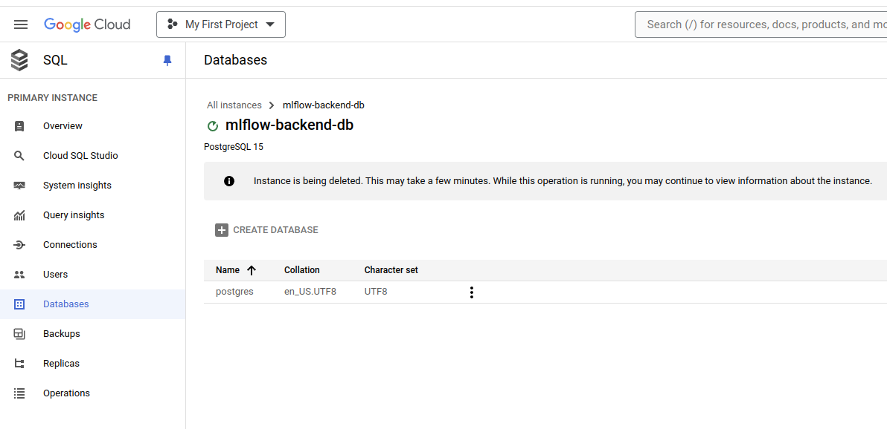
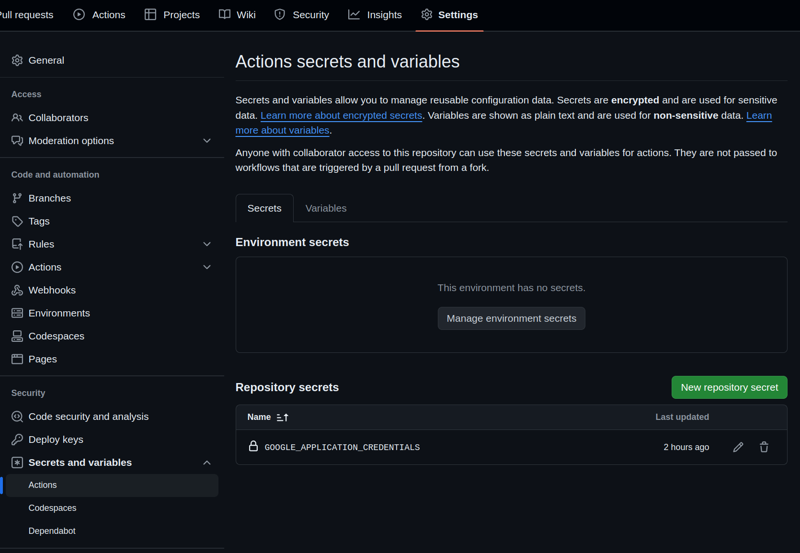
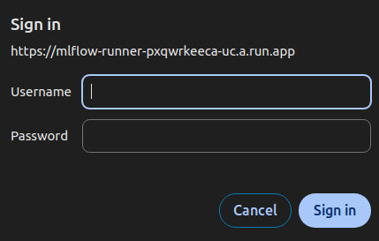
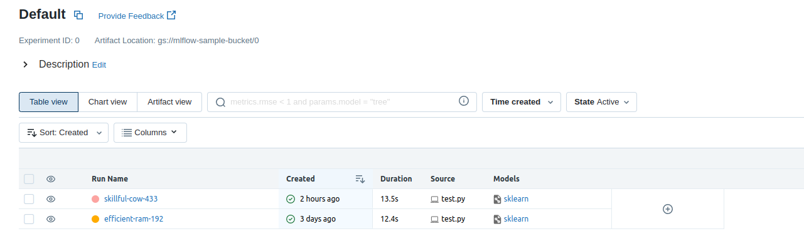



## Motive
In part 1 of the series, we looked at how we can host our own tracking server on GCP using a VM, we did see many issues with the earlier approach though, with regards to authentication, versioning, manual resource management etc. In this article, we will look at how we can use cloud run to host our server, some of the advantages that cloud run provides is that we don't need to worry about scalability and idle resources, along with providing a cleaner way for containerisation. 


## Create backend DB
We start with the same step of creating a cloud SQL DB to store our data. To do this - 
1.  Go to the [cloud SQL page](https://console.cloud.google.com/sql)
2.  Click on `create instance`
3.  Click on `create a PostgreSQL instance`
4.  Fill in the `instance ID` and `password`. e.g. - I used "mlflow-backend-db" as the instance name and "test" as the password for now.
5.  When creating an DB instance, GCP creates the admin user as "postgres" by default, the entered password is linked to this admin username.
6.  For now select DB params and configuration to minimise cost, for example, I selected a custom config of 1 vCPU and 3.75 GB RAM. Also set storage capacity to 10 GB and make it single region. 
7.  Under the connections settings, make it so that `private IP` is ticked. Under associated networking, select the default network.
8.  Under `authorized networks add 0.0.0.0/0. This gives access to the DB from any IP address on the internet.
9.  You can leave the rest as is. 
10. Click on `create instance`.  

The instance will take some time to get created. A default database named "postgres" already exists, create a new db named "mlflow" (change the name according to your needs). To do this, go to the `Databases` section after selecting your instance and click on `create database`.


## Create GCS bucket

Create a GCS bucket to store our model training artifacts. You can use the following command - 
```bash
gsutil mb gs://{ARTIFACT_BUCKET_NAME}
```

I used the bucket name "mlflow-sample-bucket". Keep in mind GCS bucket names are globally unique, so you will need to enter a different name. 

## Artifact registry
We will need a place to store our docker images, for that we will need to create a new repo. 

```bash
gcloud artifacts repositories create {REPO_NAME} \
--location=us-central1 \
--repository-format=docker
```

I used "mlflow-runner" as the name for now. 

## Service account
Our application will need access to cloud SQL, cloud storage and cloud run. For this we will be using a service account.

```bash
gcloud iam service-accounts create {SERVICE_ACC_NAME} 
```
I used "mlflow-sa" for now. 

We also have to give our service permissions and roles to be able to access different services. Run the following to give these permissions.

gcloud projects add-iam-policy-binding PROJECT_ID --member='serviceAccount:SA-NAME@PROJECT_ID.iam.gserviceaccount.com' --role='ROLE_NAME'

```bash

## RUN THESE FIRST
export PROJECT_ID={GCP_PROJECT_ID}
export SA_NAME={SERVICE_ACC_NAME}

## You can run all of these together
gcloud projects add-iam-policy-binding $PROJECT_ID \
  --member="serviceAccount:$SA_NAME@$PROJECT_ID.iam.gserviceaccount.com" \
  --role="roles/cloudsql.editor"

gcloud projects add-iam-policy-binding $PROJECT_ID \
  --member="serviceAccount:$SA_NAME@$PROJECT_ID.iam.gserviceaccount.com" \
  --role='roles/storage.objectAdmin'

gcloud projects add-iam-policy-binding $PROJECT_ID \
  --member="serviceAccount:$SA_NAME@$PROJECT_ID.iam.gserviceaccount.com" \
  --role='roles/secretmanager.secretAccessor'

gcloud projects add-iam-policy-binding $PROJECT_ID \
  --member="serviceAccount:$SA_NAME@$PROJECT_ID.iam.gserviceaccount.com" \
  --role='roles/artifactregistry.admin'

gcloud projects add-iam-policy-binding $PROJECT_ID \
  --member="serviceAccount:$SA_NAME@$PROJECT_ID.iam.gserviceaccount.com" \
  --role='roles/cloudfunctions.admin'

gcloud projects add-iam-policy-binding $PROJECT_ID \
  --member="serviceAccount:$SA_NAME@$PROJECT_ID.iam.gserviceaccount.com" \
  --role='roles/clouddeploy.serviceAgent'
```

## Get SA key 
Create the `creds.json` file with the following command. Not that this creates the file in the root folder that the command is being run in. We will use these credentials as a secret in the secret manager. 

```bash
gcloud iam service-accounts keys create creds.json --iam-account=$SA_NAME@$PROJECT_ID.iam.gserviceaccount.com 
```

## Add SA key to Secret manager
Use the following to create a secret variable called `mlflow_runner_key` using the `creds.json` we generated above.

```bash
gcloud secrets create mlflow_runner_key --data-file=creds.json   
```

We will also create secret variables for the the DB url, bucket name and mlflow credentials. 

- DB_USER_NAME = postgres (remember this is the default admin name)
- DB_USER_PASSWORD = test (you might have entered something different)
- DB_PRIVATE_IP = can be found in the overview page of the DB
- DB_NAME = mlflow (you might have entered something different)
- MLFLOW_ID = any string works (username for authentication)
- MLFLOW_PASS = any string works (password for authentication)

```bash
gcloud secrets create DB_url

printf "postgresql://{DB_USER_NAME}:{DB_USER_PASSWORD}@{DB_PUBLIC_IP}/{DB_NAME}" |gcloud secrets versions add DB_url --data-file=-
```
For the bucket 

- ARTIFACT_BUCKET_NAME=mlflow-sample-bucket

```bash
gcloud secrets create bucket_url

printf "gs://{ARTIFACT_BUCKET_NAME}" | gcloud secrets versions add bucket_url --data-file=-
```

For Mlflow ID and Password
```bash
gcloud secrets create mlflow_id
gcloud secrets create mlflow_pass

printf "{MLFLOW_ID}" | gcloud secrets versions add mlflow_id --data-file=-
printf "{MLFLOW_PASS}" | gcloud secrets versions add mlflow_pass --data-file=-
```

Afterwards, we will be using these names in our github actions workflow.

## Github Repository 
I have created a repository for the project, linked below - 


### Add secrets to github repo
We need to add a "secret" to our github repo, so that github actions can use service account to run the workflow. To add the `creds.json` we created for our service account in the [Get SA key](#get-sa-key) section to our repo secrets -  
- go to `repo settings>Security>Secrets and Variables>Actions`
- click on `New repository secret` 
- Name it `GOOGLE_APPLICATION_CREDENTIALS` and copy the contents of `creds.json` to it. 



### Repository structure
The structure of our repo is - 

```
.
├── .github/
│ └── workflows/
|   └── deploy_cloud_run.yml
├── .gitignore
├── Dockerfile
├── README.md
├── requirements.txt
├── server.sh
├── test.py
└── wsgi_server.py
```

We will go through each of these files except the gitignore, requirements and README.

### wsgi_server.py
This file wraps the mlflow server as an app inside the BasicAuth authentication. This is used to do very simple username and password based authentication. 

For the username and password, we set them up as environment variables in the Dockerfile. 

```python
import os
from wsgi_basic_auth import BasicAuth
from mlflow.server import app as mlflow_app

app = BasicAuth(mlflow_app)
```

### server.sh
Here we setup some of the internally used env variables to pass the location of our database and GCS bucket to mlflow. We also setup the authentication credentials. The variables being used here are passed during runtime through cloud run. 

After setting up the variables, we launch a Gunicorn web server which serves our python app, which is the mlflow server. `0.0.0.0:5000` means it will listen to connections from all IP addresses on port 5000. 
```bash
#!/bin/bash

export _MLFLOW_SERVER_FILE_STORE=$POSTGRESQL_URL
export _MLFLOW_SERVER_SERVE_ARTIFACTS="true"
export _MLFLOW_SERVER_ARTIFACT_DESTINATION=$STORAGE_URL
export _MLFLOW_SERVER_ARTIFACT_ROOT=$STORAGE_URL
export WSGI_AUTH_CREDENTIALS="${MLFLOW_ID}:${MLFLOW_PASS}"

exec gunicorn -b "0.0.0.0:5000" wsgi_server:app
```

### Dockerfile
The dockerfile 
- loads environment variables 
- copies the required files to our workdir
- installs the requirements using pip
- Exposes port 5000 since that is the port the mlflow server is listening for connections on.
- Runs the `server.sh` file. 

``` Docker
FROM python:3.11-slim

WORKDIR /

ENV GOOGLE_APPLICATION_CREDENTIALS='./secrets/credentials'

COPY requirements.txt requirements.txt
COPY wsgi_server.py wsgi_server.py 
COPY server.sh server.sh

RUN pip install --upgrade pip && pip install -r requirements.txt

EXPOSE 5000

RUN chmod +x server.sh
ENTRYPOINT ["./server.sh"]
```

### deploy_cloud_run.yml
The yml file is used to define the github actions workflow. The workflow is reponsible for deploying our container to cloud run. I have added comments to the different parts to annotate them below.

```yaml
# Build and push container to artifact register, deploy on cloud run

# the name of the workflow
name: Deploy MLFlow server

# Trigger the workflow when we push to "main"
on:
  push:
    branches: [main]

# 
jobs:
  login-build-push:
    name: Build, Push and Run
    runs-on: ubuntu-latest

    ############## INSERT YOUR OWN ENV VARIABLES HERE ########################
    env:
      REGION: us-central1
      PROJECT_ID: hardy-symbol-432213-a7
      REPOSITORY: mlflow-runner
      SERVICE_ACCOUNT: mlflow-sa@hardy-symbol-432213-a7.iam.gserviceaccount.com
      SERVICE_NAME: mlflow-runner
      PORT: 5000
      SA_KEY_NAME: mlflow_runner_key 
    ############################################################################

    steps:
      # checkout code from the github repo
      - name: Checkout
        uses: actions/checkout@v3

      # Authenticate to GCP using our service account credentials and project ID
      - id: 'auth'
        name: Authenticate to GCP
        uses: google-github-actions/auth@v1
        with:
          project_id: '${{ env.PROJECT_ID }}'
          # we stored the credentials json as a github repository secret
          credentials_json: '${{ secrets.GOOGLE_APPLICATION_CREDENTIALS }}' 
      
      # Configures Docker to use GCPs artifact repository for our region
      - name: Configure Docker to use gcloud as a credential helper
        run: |-
          gcloud auth configure-docker "${{ env.REGION }}-docker.pkg.dev"

      # Build the Docker image
      - name: 'Docker config'
        run: |-
          docker build -t "${{ env.REGION }}-docker.pkg.dev/${{ env.PROJECT_ID }}/${{ env.REPOSITORY }}/mlflow:${{ github.sha }}" .

      # Push the image to the artifact registry
      - name: 'Push container'
        run: |-
          docker push "${{ env.REGION }}-docker.pkg.dev/${{ env.PROJECT_ID }}/${{ env.REPOSITORY }}/mlflow:${{ github.sha }}"
      
      # Deploy the docker image to cloud run
      # We also provide the path to the secrets being used, and what env variables to assign them to
      - name: 'Deploy to cloud run'
        run: |- 
          gcloud run deploy "${{ env.SERVICE_NAME }}" \
          --image "${{ env.REGION }}-docker.pkg.dev/${{ env.PROJECT_ID }}/${{ env.REPOSITORY }}/mlflow:${{ github.sha }}" \  
          --region "${{ env.REGION }}" \
          --service-account "${{ env.SERVICE_ACCOUNT }}" \
          --update-secrets=/secrets/credentials="${{ env.SA_KEY_NAME }}":latest \
          --update-secrets=POSTGRESQL_URL=DB_url:latest \
          --update-secrets=STORAGE_URL=bucket_url:latest \
          --update-secrets=MLFLOW_ID=mlflow_id:latest \
          --update-secrets=MLFLOW_PASS=mlflow_pass:latest \
          --memory 2Gi \
          --allow-unauthenticated \
          --port "${{ env.PORT }}" 
```

### test.py
A sample script to test out our MLflow server once deployed. Insert your credentials and MLflow tracking URI before running it. 

The tracking uri can be found on your cloud run service page. 

```python
import os 
import mlflow
import mlflow.sklearn
from sklearn.model_selection import train_test_split
from sklearn.linear_model import LinearRegression
import numpy as np
from sklearn.metrics import mean_squared_error, r2_score

# Generate random data
np.random.seed(42)
X = np.random.rand(100, 1)
y = 3 * X.squeeze() + 2 + np.random.randn(100) * 0.5

############## Set MLflow tracking URI ##############
os.environ["MLFLOW_TRACKING_USERNAME"] = ""
os.environ["MLFLOW_TRACKING_PASSWORD"] = ""

mlflow.set_tracking_uri("")
#####################################################

# Split the data
X_train, X_test, y_train, y_test = train_test_split(
    X, y, test_size=0.2, random_state=42
)

# Start an MLflow run
with mlflow.start_run():
    model = LinearRegression()
    model.fit(X_train, y_train)
    predictions = model.predict(X_test)

    mlflow.log_param("fit_intercept", model.fit_intercept)
    mse = mean_squared_error(y_test, predictions)
    r2 = r2_score(y_test, predictions)
    mlflow.log_metric("mse", mse)
    mlflow.log_metric("r2", r2)

    mlflow.sklearn.log_model(model, "linear_regression_model")

    print(f"Model saved in run {mlflow.active_run().info.run_id}")
    print(f"MSE: {mse}")
    print(f"R2: {r2}")
```

## Testing it out
You can get the link of your MLflow server from the cloud run service page! Once you have this, enter it in your browser.

You should be prompted for your username and ID as follows - 


Enter your username and password to access the dashboard. Enter your parameters into the `test.py` script and run it, you should be able to see your outputs in the dashboard if everything is working properly!


And we're all done!

## References 

- https://medium.com/@andrevargas22/how-to-launch-an-mlflow-server-with-continuous-deployment-on-gcp-in-minutes-7d3a29feff88
- https://dlabs.ai/blog/a-step-by-step-guide-to-setting-up-mlflow-on-the-google-cloud-platform/