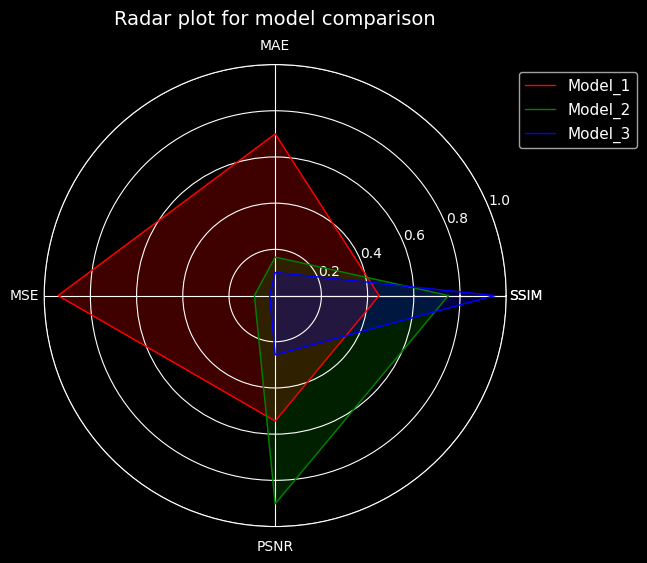

<!-- Contents-
- [Motive](#motive)
- [What are radar plots?](#what-are-radar-plots)
- [Sample data](#sample-data)
- [Data Normalisation](#data-normalisation)
- [Plotting the data](#plotting-the-data)
- [Conclusions](#conclusions) -->


## Motive 
Does looking at a table comparing model peformance across multiple metrics feel bothersome to you? Lets see how radar plots can help us quickly visually compare model performance across multiple metrics. 

This is just a single use case of using radar plots though, these can be used for so much more such as - comparing multiple products across multiple metrics, comparing multiple people across multiple skills, etc. 

The first time I appreciating radar plots was in Fifa 18, where you could compare players across pace, skill, strength, etc.very easily. Made quick substitutions very simple. 

Visually they look very cool and are certain to add visual flair to your next presentation. 


## What are radar plots?
Defining them a bit more formally, a radar plot is a type of chart used to display multiple variables on a two-dimensional graph. Each variable is plotted on a separate axis that radiates from the center of the graph, and data points are connected to create a polygon shape. 

Radar plots are commonly used to compare the performance of different models or entities across multiple metrics. They are helpful for visualizing how different variables affect overall performance and are widely used in fields such as data analysis, engineering, and sports.


## Sample data 
Here we will just be using a randomly generated table of data. Lets say we have a hypothetical image to image translation problem. We will compare 3 models across 4 metrics [SSIM](https://en.wikipedia.org/wiki/Structural_similarity), [PSNR](https://en.wikipedia.org/wiki/Peak_signal-to-noise_ratio), [MAE](https://en.wikipedia.org/wiki/Mean_absolute_error) and [MSE](https://en.wikipedia.org/wiki/Mean_squared_error). We load this in the form of a `pandas` dataframe named `sample_df`. 


**NOTE!** Keep in mind the data makes no sense in terms of metrics and is only meant for visualisation purposes!


|Model   | SSIM | MAE |  MSE | PSNR|
|--------|------|-----|------|-----|
|Model_1 | -0.1 | 2.1 | 4.70 | 32.6|
|Model_2 |  0.5 | 0.5 | 0.45 | 54.1|
|Model_3 |  0.9 | 0.3 | 0.12 | 15.4|

## Data Normalisation
The data needs to be normalized before we can plot it. This is because we are plotting multiple metrics on the same scale, so our values also need to be on the same scale. 

lets normalize all of our data to be between 0 and 1.

- SSIM varies b/w -1 and 1, to normalize we just add 1 and divide by 2.
- MAE can be vary between 0 and infinity, lets assume max valye is 3 for MAE.
- Same case as MAE, max value assumed to be 5
- PSNR for 8-bit grayscale images typically varies b/w 0-60 dB, so here lets - just normalize by dividing by 60.

```
sample_df["SSIM"] = (sample_df["SSIM"] + 1) / 2
sample_df["MAE"] = sample_df["MAE"] / 3
sample_df["MSE"] = sample_df["MSE"] / 5
sample_df["PSNR"] = sample_df["PSNR"] / 60
```
This is what the data looks like after normalization.

|Model   | SSIM | MAE |  MSE | PSNR|
|--------|------|-----|------|-----|
|Model_1 |  0.45|0.70 |	0.94 |0.54 |
|Model_2 |	0.75|0.16 |	0.09 |0.90 |
|Model_3 |	0.95|0.10 |	0.02 |0.25 |


## Plotting the data
We will use good ol' `matplotlib` to create our plots. The following function is used to create the plots. The different parts of the codes are explained in the comments. 


```python
def radar_plot(df, attrs_to_plot, color_list=["r", "g", "b"], title="Radar plot"):
    # get the number of different metrics to plot
    n_metrics = len(attrs_to_plot)

    # we get the angles for each different metric
    angles = list(np.linspace(0, 2 * np.pi, n_metrics, endpoint=False))

    # get label for each metric
    labels = list(attrs_to_plot)

    # we need the plot to be closed, so we close the plot
    # by adding the first metric at the end again
    angles += angles[:1]
    labels += labels[:1]

    # pass polar as true for ciruclar plot
    fig, ax = plt.subplots(figsize=(6, 6), subplot_kw=dict(polar=True))

    # Set the labels for each of the angles
    ax.set_thetagrids(np.degrees(angles), labels=labels)

    # since we normalized all of our data to be between 0 and 1
    # we set the limits of the plot to be between 0 and 1
    ax.set_ylim(0, 1)

    for color, index_name in zip(color_list, df.index):
        # get the values for each row of the metrics
        # do note that we set the model name as the index
        vals = list(df[attrs_to_plot].loc[index_name])

        # wrap around the values so that the plot is closed
        vals += vals[:1]

        # plot the polygon
        ax.plot(angles, vals, linewidth=1, color=color, label=index_name)

        # fill the area with color
        ax.fill(angles, vals, alpha=0.25, color=color)

    plt.legend(loc="upper right", bbox_to_anchor=(1.3, 1), fontsize=11)
    plt.title(title, fontsize=14, pad=10)
```

Do note that the index of the `sample_df` has been changed to be the model name instead of numeric values. We then call the `radar_plot` as follows - 
```python
radar_plot(
    sample_df,
    attrs_to_plot=["SSIM", "MAE", "MSE", "PSNR"],
    title="Radar plot for model comparison")
```


One of the issues we see here is that there is a mix of negatively(lower is better) and positively(higher is better) oriented scores. This can create a bit of confusion when looking at the plot. Maybe if we invert the MSE and MAE using(1 - metric_value) then it might make more sense?

Plotting after inverting using the following code - 

```python
sample_df["MAE_rev"] = 1 - sample_df["MAE"]
sample_df["MSE_rev"] = 1 - sample_df["MSE"]

radar_plot(
    sample_df,
    attrs_to_plot=["SSIM", "MAE_rev", "MSE_rev", "PSNR"],
    title="Radar plot for model comparison",
)
```


## Conclusions
Hmm..., honestly still confusing. I think this can lead to confusion in explaining what rev_mae and rev_mse is. I think the better approach would be to plot negatively and positively oriented metrics on different plots altogether.

But regardless, these plots can be used for so much more than just comparing model metrics and can be used for comparing input features or data samples together. Here are some pros and cons of these plots.

Pros-
- Gives a nice summary of the different metrics/features for different models/data samples etc.
- Way better than looking at a table and trying to identify what each model is best at.
- Radar plots are visually very easy to understand and look nice aesthetically.
- Can be adjusted very easily for multiple metrics.

Cons -
- More models/samples can result in visual clutter. e.g - plotting the performance of 10 models like this would look horrible.
- All data needs to be normalized before plotting.
- Mixing of positive and negative oriented metrics can lead to confusion.
- It is very hard to compare to radar plots if the range and variables are different. 


 Github Notebook 
