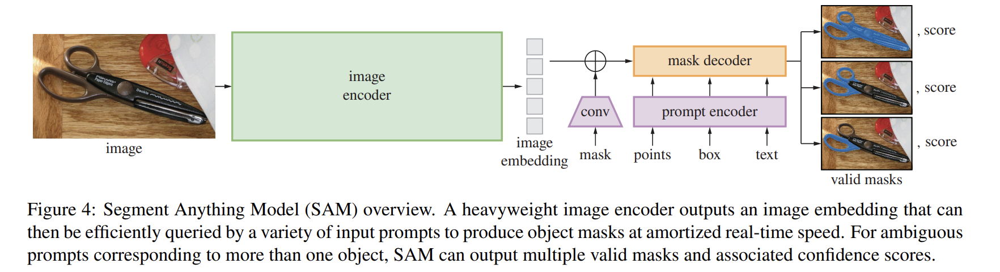

These are notes for my reading of the segment anything paper. Check out the orignal project page by Meta AI at the link below



Segment Anything by Meta AI 


## High Level

- Main idea behind the model is to build a foundational model for Computer Vision similar to the state of the NLP community + allow it to be promptable. 

- This model can then be used for downstream segmentation problems using prompt engineering and for some cases zero shot finetuning.

- They mention 3 main parts of the project as -

  - What **task** will enable zero-shot generalization?

    - Chose promptable segmentation, as it is a suitable pretraining task for a lot of CV problems.

    - Goal of the task is to return a valid segmentation mask given any segmentation prompt.

  - What is the corresponding model architecture?

    -   Real-time flexible promptable model

    -   Flexible here means it must be able give a valid segmentation mask for any prompt. 

    -   Since the model is supposed to be interactive, it needs real time outputs. 

    -   Model - 

        -   a powerful image encoder computes an image embedding

        -   a prompt encoder embeds prompts

        -   Image an prompt embedding sources are combined in a lightweight mask decoder that predicts segmentation masks

    -   Types of supported prompts - 

        -   Box

        -   Mask

        -   Point

        -   Free form text

    -   What data can power this task and model?

        -   To build the dataset, they use the model for labelling. They call this the "data engine"

        -   To achieve strong generalisations to new data distributions, it was necessary to train SAM on large and diverse set of masks. 

        -   No existing dataset satisfied these requirements.

        -   They use 'model in the loop' annotation.

        -   3 stages to the "data engine" - 

            -   Assisted-manual

                -   Model assists annotators in annotation. 

            -   Semi-auto.

                -   Model can generate annotations for a subset of objects by prompting with likely object locations and masks. (is this because of good performance after stage 1?)

                -   Annotators annotate the rest of the objects.

            -   Fully auto  

                -   Model is prompted with a regular grid of foreground points. (what does this mean?)

                -   This results in generation of ~100 high quality masks per image 

-   Final dataset - The final dataset, SA-1B, includes more than 1B masks from 11M licensed and privacy-preserving images. The masks were manually verified to have good annotations. 

-   Focused on AI ethics to look at potential geographical and racial biases the model might have

-   Experiments

    -   Tested using 23 segmentation datasets to find out that it generated high-quality masks from a single foreground point, these annotations were only slightly below the ground truth. 

    -   Got good results on zeroshot downstream tasks such as edge detection, object proposal generation, instance segmentation and preliminary exploration of text-to-mask prediction

    -   These results suggest that SAM can be used out-of-the-box with prompt engineering to solve a variety of tasks involving object and image distributions beyond the model's training data.

## Task 
- The promptable segmentation task is to return a valid segmentation mask given any prompt. 
- “Valid” here means that a segmentation mask should be returned even if the prompt is ambiguous. Look at the figure below to understand what ambiguous means here.

- This task was chosen since it acts as a natural pre-training algorithm and a general method for zero-shot transfer to downstream tasks via prompting.

- One suggested method of using for downstream instance segmentation 
  - For example, if one has a bounding box detector for cats, cat instance segmentation can be solved by providing the detector’s box output as a prompt to our model.

- An important distinction pointed out by them is that the model is not trained in a multitask scenario but can perform different tasks at inference tasks by pairing it with different components.

## Model

-   Three main components - 

    -   image encoder

        -   They use masked autoencoder (MAE) pre-trained ViT adapted to process high res outputs. 

        -   What is a masked autoencoder?

    -   a flexible prompt encoder

        -   Prompts are broken down into 2 categories- 

        -   Sparse - points, boxes and text 

        -   Dense - mask

        -   Points and boxes are encoded using positional embeddings 

        -   Text is converted to embeddings using CLIP encoder.

        -   Dense prompts are encoded using convolutional operations.

    -   fast mask decoder

        -   The mask decoder efficiently maps the image embedding, prompt embeddings, and an output token to a mask.

        -   The modified decoder block uses prompt self-attention and cross-attention in two directions (prompt-to-image embedding and vice-versa) to update all embeddings.

        -   After running two blocks, we upsample the image embedding and an MLP maps the output token to a dynamic linear classifier, which then computes the mask foreground probability at each image location

-   The model was modified to allow for multiple masks being generated for a single prompt. This is to tackle ambiguity in the prompts. They set the limit of masks generated to 3, as they found it to be sufficient for most usecases. 

-   The model is designed to be efficient. The image encoder is the computationally heavy part of the model, afterwards the prompt encoder and mask decoder can run efficiently even in a browser.

-   This design allows testing the model with different prompts very easily, since the image embeddings don't need to be computed repeatedly. 

-   Mask prediction - dice + focal loss was used for training.

## Data Engine
-   The data engine has three stages - 

    -   model-assisted manual annotation stage

        -   Normal image annotation assisted by the model in an interactive browser UI environment

        -   No named labels for the objects were collected.

        -   The model was trained on common segmentation datasets before this and then on the slice of the data that had been annotated in stage 1.

        -   4.3M masks were collected from 120k images in this stage.

        -   Model was trained 5-6 times during this phase

    -   semi-automatic stage with a mix of automatically predicted masks and model-assisted annotation 

        -   The aim here was to increase the diversity of masks in order to improve the models ability to segment anything.

        -   The model was allowed to make predictions first and then the less common objects were labelled by the annotators.

        -   Model was trained 5-6 times during this phase.

    -   fully automatic stage in which our model generates masks without annotator input

        -   Enough data had been collected by this point to allow for the model to train automatically.

        -   The model was prompted with 32 x 32 grid of points and tasked to predict the masks for these.

        -   The concept of stable mask is introduced, a mask is stable if thresholding the probability map at 0.5 - delta and 0.5 + delta results in similar masks. 

            -   delta = 0.3

            -   mask_over = mask > 0.5  + delta

            -   mask_under = mask > 0.5 - delta

            -   similarity(mask_over, mask_under)

        -   After selecting confident masks NMS was applied to filter duplicates. 

        -   Fully automatic mask generation was applied to 11M images to generated 1.1B masks.

-   The SA-1B dataset has been released online, it consists of only generated masks. 

-   A comparison of the generated masks was done with manually annotated masks and showed that the quality of the generated masks is good. 

-   The authors performed a bias and fairness analysis of the dataset as well.

## Zero-shot Experiments
-   They analysed the performance of the model on different zero-shot experiments. 

-   The tasks are as follows - 

    -   Edge detection

        -   Generated segmentation masks and removed duplicates using NMS. These were generated by prompting the model with 16x16 grids of foreground points.  

        -   Edge maps are then computed using sobel filtering of un-thresholded mask probability maps and postprocessing.

        -   It produced reasonable edge maps. 

    -   Object proposal generation

        -   To generate object proposals, they ran a slightly modified version of the automatic mask generation pipeline and output the masks as proposals.

    -   Instance segmentation

    -   Segment objects from free-form text

