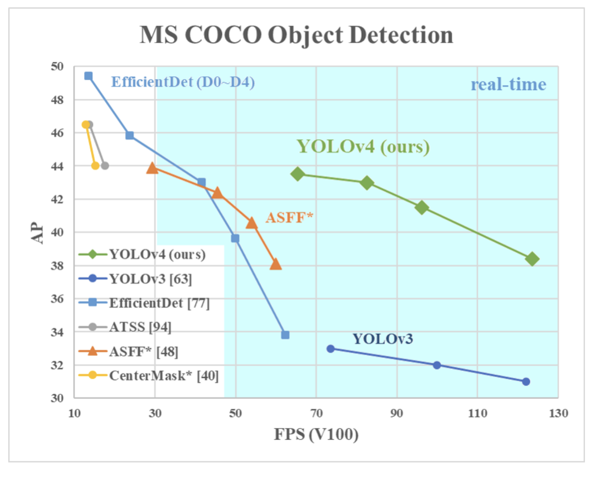
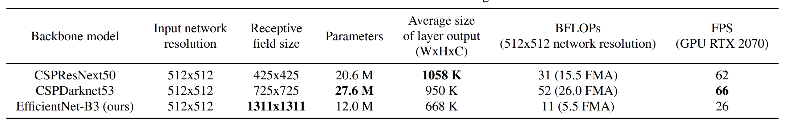
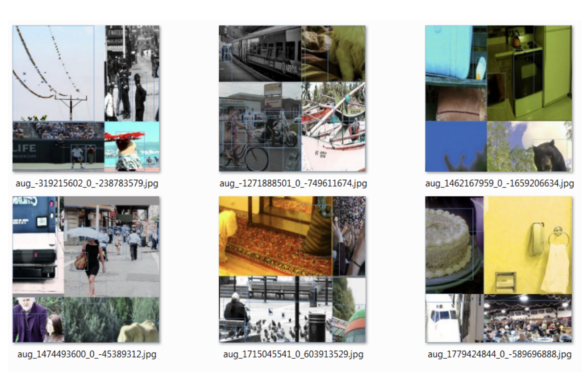
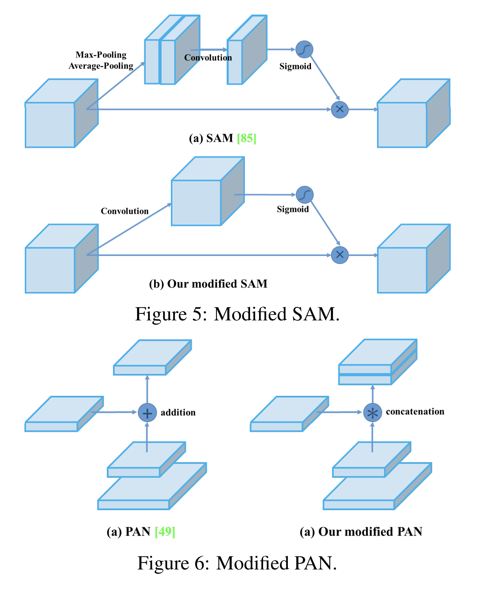

These are notes for my reading of the YOLO v5 paper. Check out the orignal paper at the link below


YOLO v4 


<!--  -->

## High Level 
- They create a CNN that operates in real time on a conventional GPU and can be trained on a single GPU as well. 
- Their main contributions are as follows -
  - Develop and efficient and powerful object detection model. It means conventional GPUs such as a 1080 Ti or 2080 Ti can be used to train the model.
  - They look at the SOTA *Bag-of-Freebies* and *Bag-of-Specials* methods for object detection during training. 
  - *Bag-of-Freebies (BoF)* - Methods which are used to train the model with no added cost during inference time. e.g - data augmentation, negative hard mining, focal loss, label smoothing, IoU based loss, 
  - *Bag-of-Specials (BoS)* - Plugin modules and post processing methods which only increase the inference cost by a small amount but can significantly improve the accuracy of object detection. e.g - techniques to enlarge receptive field (SPP, ASPP, FPB), introducin attention mechanism(SE, SAM), strengthening a feature integration capability (BiFPN, ASFF), post processing(soft NMS)
  - They modifty current SOTA methods to make them more suitable for single GPU training.

- They breakdown object detetors to be built of the following main parts - 
  - **Input** - Image, Patches and Image pyramid
  - **Backbones** - VGG16, ResNet, EfficientNet etc.
  - **Neck** - 
    - **Additional blocks** - SPP, ASPP, RFB, SAM
    - *Path-aggregation blocks** - FPN, PAN, NAS-FPN, Fully connected FPN, SFAM
  - **Heads** - 
    - **Dense Prediction (one - stage)** - RPN, SSD, YOLO, RetinaNEt, CornerNEt, FCOS
    - **Sparse Prediction (two - stage)** - Faster RCNN, Mask RCNN, RepPoints

## Methodology
- They first look at different models which can be used as a backbone for the object detector, in particular they look at the following 3 models 
<!--  -->
- Their objective is to fine the optimal balance among the input network resolution, convolutional layer number, the param number and the number of filters.
- They also note the fact that there are differences in performance when looking at the model backbones performance in a classification setting vs an object detection setting.
- The next thing they looked at was paramater aggregation with FPN, PAN, ASFF etc. 
- They mention that a detection model requires the following -
  - Higher input network size (resolution) - for detecting multiple small-sized objects
  - More layers - For a higher receptive field to cover the increased size of input network.
  - More paramters - for greater capacity of a model to detetct multiple objects of different sizes in a single image.
- They selected the CSPDarknet53 as the bacbone model due the fact that it has a higher input resolution than the CSPResNeXt50 and contains more paramaters, along these theoretical justifications, they also say that they conducted many additional experiments. 
- They use the SPP block over the CSPDarknet53, since it significantly increases the receptive field, separates out the most significant context features and causes almost no reduction of the network operation speed. 
- They use PANet as the method for the instead of the FPN. 
- 
- Selection of BoF and BoS - 
  - They introduced new methods of data augmentation mosaic(look at image below) and Self-Adversarial training(SAT). In SAT - 
    - The network alters the original image, executing an adversarial attack on itself.
    - The network then makes predictions on the altered image. 
  - They select optiman hyperparams while applying genetic algos
  - They modifed some exsiting methods to make theur design suitble for efficient training and detection - modified SAM, modified PAN, and Cross mini-Batch Normalization (CmBN)
<!--  -->

- They modify SAM from spatial-wise attention to pointwise attention, and replace shortcut connection of PAN to concatenation.
<!--  -->

- **Final list of config and BoF and BoS**
  - **Backbone** - CSPDarknet53
  - **Neck** - SPP, PAN
  - **Head** - YOLO V3

- **Final list of BoS and BoF** - 
  - Bag of Freebies (BoF) for backbone: CutMix and Mosaic data augmentation, DropBlock regularization, Class label smoothing.
  - Bag of Specials (BoS) for backbone: Mish activation, Cross-stage partial connections (CSP), Multiinput weighted residual connections (MiWRC)
  - Bag of Freebies (BoF) for detector: CIoU-loss,CmBN, DropBlock regularization, Mosaic data augmentation, Self-Adversarial Training, Eliminate grid sensitivity, Using multiple anchors for a single ground truth, Cosine annealing scheduler, Optimal hyperparameters, Random training shapes.
  - Bag of Specials (BoS) for detector: Mish activation, SPP-blockSAM-block, PAN path-aggregation block, DIoU-NMS.